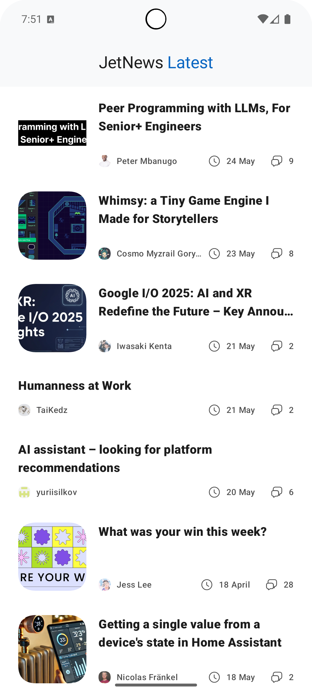
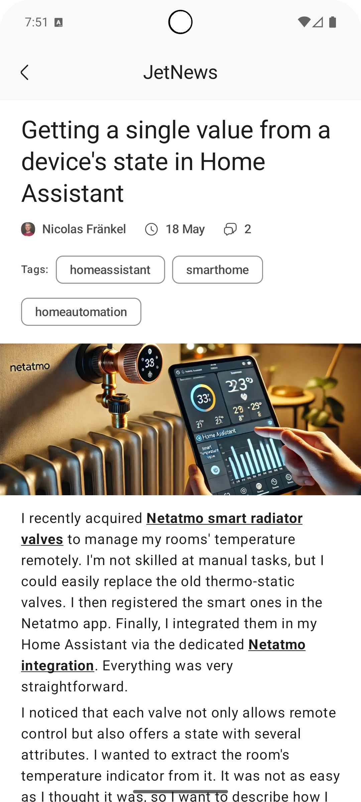

# JetNews - News App – Compose Multiplatform + Clean Architecture

This is a minimal cross-platform News App built with **Jetpack Compose Multiplatform** using **Clean
Architecture** and **MVVM**. It is designed as a reference project for learning scalable
architecture with Kotlin Multiplatform.

---

## Tech Stack

* Jetpack Compose Multiplatform for UI (Android + IOS (Untested))
* Koin for Dependency Injection
* Ktor for HTTP networking
* Coil for image loading (via shared image module)
* Kotlin Coroutines & Flow
* MVVM pattern + Clean Architecture structure

---

## Architecture

This project follows Clean Architecture with layered separation of concerns:

```
UI (features/home, features/article)
   ↓
ViewModel (per screen)
   ↓
UseCase (core/domain)
   ↓
Repository (core/data)
   ↓
RemoteDataSource (core/network)
   ↓
ApiService (Ktor implementation)
```

Each layer has a single responsibility, is testable in isolation, and is implemented in a modular
way using Kotlin Multiplatform modules.

---

## Project Structure

```
app/                          # Compose multiplatform entry point
core/
  ├─ data/                    # (Repository, Paging, Data source, Api service) implementations
  ├─ domain/                  # Entities and use cases
  ├─ network/                 # Network utilities
  ├─ image/                   # Multiplatform image loader (Coil)
  ├─ paging/                  # Paging state utilities
  ├─ resources/               # Multiplatform resources
  ├─ design-system/           # Shared UI components and theming
  ├─ date/                    # Date formatting utils
  ├─ compose:markdown/        # Markdown rendering
  ├─ di/                      # Koin modules
  └─ common/
       ├─ compose/            # Shared Compose utilities
       └─ base/               # Base ViewModel, models, state

features/
  ├─ home/                    # Home screen and logic
  └─ article/                 # Article detail screen and logic
```

---

## Screenshots

| Home                     | Detail                       |
|--------------------------|------------------------------|
|  |  |